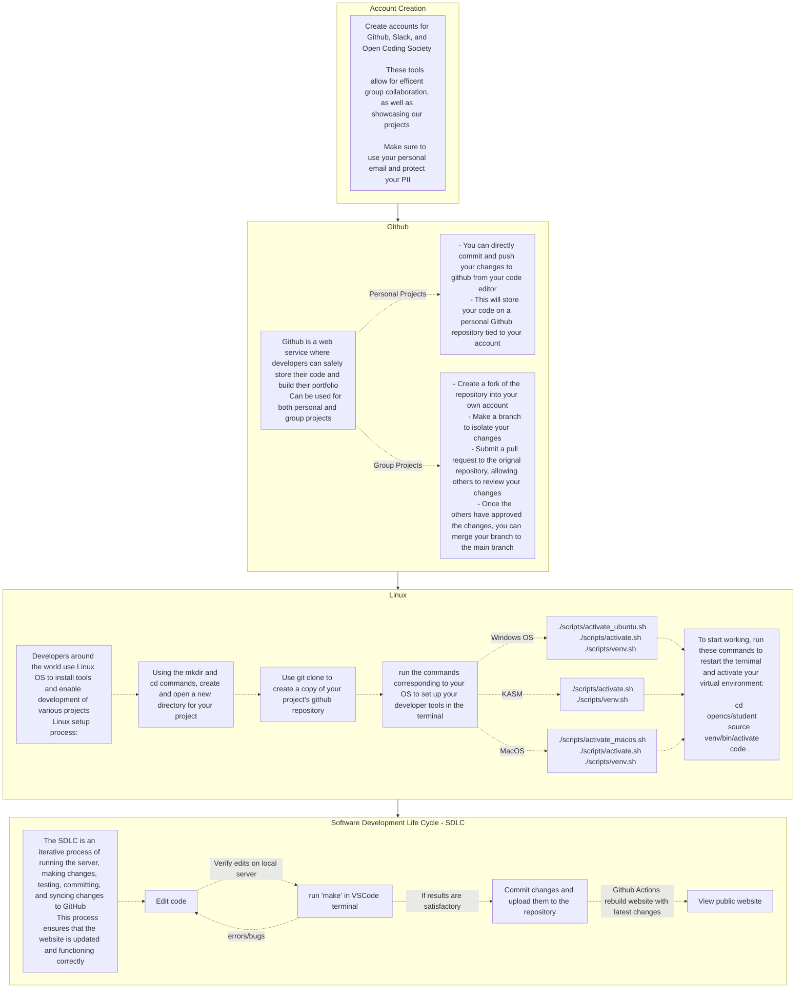

## Tools and Equipment setup

A visual to remind us of the tools we use in our development journey

```mermaid
%%{init: {"themeVariables": {"fontSize": "20px"}}}%%
flowchart TD
    %% Accounts Section
    subgraph accounts_subgraph[Account Creation]
        accounts_node[Create accounts for Github, Slack, and Open Coding Society <br/> 
        These tools allow for efficent group collaboration, as well as showcasing our projects <br>
        Make sure to use your personal email and protect your PII]
    end


    %% Github Section
    subgraph github_subgraph[Github]
        github_node[Github is a web service where developers can safely store their code and build their portfolio
        Can be used for both personal and group projects]

        github_personal[
        - You can directly commit and push your changes to github from your code editor
        - This will store your code on a personal Github repository tied to your account]

        github_group[
        - Create a fork of the repository into your own account
        - Make a branch to isolate your changes
        - Submit a pull request to the orignal repository, allowing others to review your changes
        - Once the others have approved the changes, you can merge your branch to the main branch]
    end

    %% Arrows: Github Section
    github_node -.-> |Personal Projects| github_personal
    github_node -.-> |Group Projects| github_group


    %% Linux Section
    subgraph linux_subgraph[Linux]
        linux_node[Developers around the world use Linux OS to install tools and enable development of various projects
        Linux setup process:]

        linux_A[Using the mkdir and cd commands, create and open a new directory for your project]

        linux_B[Use git clone to create a copy of your project's github repository]

        linux_C[run the commands corresponding to your OS to set up your developer tools in the terminal]

        linux_windows[./scripts/activate_ubuntu.sh
        ./scripts/activate.sh
        ./scripts/venv.sh]

        linux_KASM[./scripts/activate.sh
        ./scripts/venv.sh]

        linux_Mac[./scripts/activate_macos.sh
        ./scripts/activate.sh
        ./scripts/venv.sh]

        linux_D[To start working, run these commands to restart the ternimal and activate your virtual environment:<br/>
        cd opencs/student
        source venv/bin/activate
        code .]
    end

    %% Arrows: Linux Section
    linux_node -.-> linux_A
    linux_A -.-> linux_B
    linux_B -.-> linux_C
    linux_C -.-> |Windows OS| linux_windows
    linux_C -.-> |KASM| linux_KASM
    linux_C -.-> |MacOS| linux_Mac
    linux_windows -.-> linux_D
    linux_KASM -.-> linux_D
    linux_Mac -.-> linux_D

    %% SDLC Section
    subgraph SDLC_subgraph[Software Development Life Cycle - SDLC]
        SDLC_node[The SDLC is an iterative process of running the server, making changes, testing, committing, and syncing changes to GitHub
        This process ensures that the website is updated and functioning correctly]

        SDLC_A[Edit code]

        SDLC_B[run 'make' in VSCode terminal]

        SDLC_C[Commit changes and upload them to the repository]

        SDLC_D[View public website]
    end

    %% Arrows: SDLC Section
    SDLC_node -.-> SDLC_A
    SDLC_A -.-> |Verify edits on local server| SDLC_B
    SDLC_B -.-> |errors/bugs| SDLC_A
    SDLC_B -.-> |If results are satisfactory| SDLC_C
    SDLC_C -.-> |Github Actions rebuild website with latest changes| SDLC_D
    %% Arrows: Overall Flowchart
    accounts_subgraph --> github_subgraph
    github_subgraph --> linux_subgraph
    linux_subgraph --> SDLC_subgraph
```
